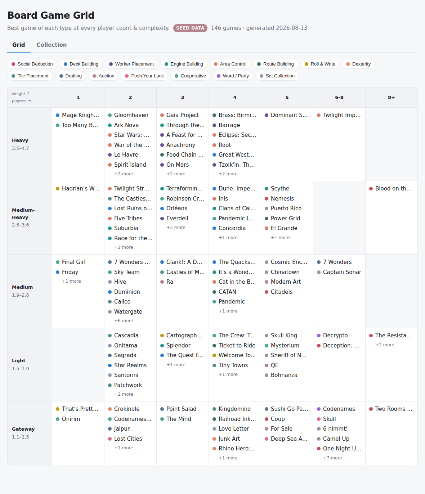

# Board Game Grid

Curate a board-game collection as a 2-D grid:

- **Columns — player count:** `1, 2, 3, 4, 5, 6-8, 8+`
- **Rows — complexity/weight:** data-mined quantile buckets, so each row holds a
  comparable number of games instead of a near-empty "heavy" row.
- **Inside each cell:** a subset chosen for *coverage* of a continuous game
  space — no two near-identical games, however well-ranked both are.

Games live in an n-dimensional feature space: latent **genre dimensions**
factored out of BGG's mechanic/category data (a game isn't "a deck builder",
it's 0.7 deck-building / 0.4 worker-placement), plus weight and playtime.
Selection fills a radar chart over those genre axes, so every cell shows the
best game of each *kind* without anyone hand-defining the kinds — and the same
math powers a **collection builder**: anchor games you love, fill the rest by
coverage, and see the gaps.

The output is an interactive static site you can host on GitHub Pages.



## How it fits together

```
pipeline/            Python — two independent steps joined by a dataset file
  fetch.py           live BGG capture  -> data/games.json      (touches network)
  build.py           dataset           -> web/public/grid.json (no network)
  dataset.py         the dataset file format (load/save)
  client.py          live BGG XML API2 client (cached), used by fetch
  config.py          the two axes + tunables (edit me first)
  features.py        the continuous feature space (IDF -> NMF genres -> vectors)
  coverage.py        probabilistic radar-chart coverage (shared math)
  assign.py          swappable per-cell selection (Coverage/Mmr/GreedyAssigner)
  collection.py      whole-collection builder: anchors, gap analysis
  archetypes.py      display-label taxonomy (mechanic/category -> archetype)
  buckets.py         player-count columns + quantile weight rows
data/
  games.seed.json    committed proxy dataset (same shape as a live capture)
  games.json         live capture (git-ignored, made by fetch)
web/                 Vite + React explorer, builds into ../docs
docs/                the built site GitHub Pages serves
```

The pipeline is two decoupled stages with a **dataset** in the middle:

```
fetch.py ──▶ data/games.json ─┐
                              ├─▶ build.py ──▶ grid.json ──▶ web
data/games.seed.json ─────────┘
```

`build.py` only ever *consumes a dataset* — it has no idea whether the games
came from a live capture or the seed proxy. Both files share one schema
(`source`, `generatedAt`, `games[]`), so switching data sources is nothing more
than pointing the build at a different file. The seed proxy carries every field
a live capture would, `best_count` included, so no stage has to guess.

## Run it

**Build the grid from the committed seed proxy (no network):**

```bash
pip install -r requirements.txt     # numpy + scikit-learn power the feature space
python -m pipeline.build            # reads data/games.seed.json -> grid.json
python -m pipeline.build --assigner mmr      # distance-based alternative
python -m pipeline.build --assigner greedy   # archetype-taxonomy baseline
```

**Build or evaluate a collection (the Collection tab):**

```bash
python -m pipeline.collection --anchors "CATAN" --size 15   # fill around anchors
python -m pipeline.collection --anchors "CATAN" --evaluate  # gaps only, no filling
```

**Refresh from live BoardGameGeek data (two steps):**

```bash
python -m pipeline.fetch --limit 500            # -> data/games.json
python -m pipeline.build --dataset data/games.json
```

`fetch` reads BGG's ranked listing, hydrates each game via the XML API2
(weight, the community best-player-count poll, mechanics, categories) and
caches every response under `data/cache/`. `build` is unchanged either way.

**Build the site:**

```bash
cd web
npm install
npm run build        # emits the static site into ../docs
npm run dev          # or run it locally with hot reload
```

## Publish on GitHub Pages

Repo **Settings → Pages → Build and deployment → Deploy from a branch**, then
pick this branch and the **`/docs`** folder. The site goes live at
`https://<user>.github.io/<repo>/`.

## The feature space and selection

`pipeline/features.py` embeds every game:

1. Game × signal incidence matrix from BGG mechanic/category names,
   IDF-weighted so ubiquitous signals (Hand Management) count less than
   distinctive ones (Hidden Roles, Flicking).
2. NMF factors it into ~10 latent genre dimensions with non-negative,
   human-readable loadings; each dimension is named by its top signals
   (on the seed data they come out as recognisable genres — social deduction,
   dexterity, tile-laying, party/word — with no hand labelling).
3. A game's vector = normalised genre loadings + mildly scaled weight and
   log-playtime. A global 2-D PCA of these vectors feeds the per-cell
   similarity scatter in the site's detail drawer.

### Coverage selection (the default)

Picture a radar chart with one spoke per genre dimension. Each game covers
every axis with "probability" `quality × loading`, and a set of games covers
an axis unless all of them miss it:

```
coverage(axis) = 1 − ∏(1 − wᵢ)
```

So Dominion (0.7 deck-building) covers that axis to 0.7; adding Star Realms
(0.6) only lifts it to 0.88 — near-duplicates have tiny marginal value.
Selection is greedy: the best-ranked game leads, then whatever fills the most
still-empty radar area, stopping when nothing left would add much
(`GAIN_FLOOR`) — so rich cells naturally get more picks than thin ones.
Coverage functions are submodular, which makes this greedy provably
near-optimal (≥ 1−1/e of the best possible set).

`--assigner mmr` (maximal marginal relevance: rank blended with distance from
picks) and `--assigner greedy` (one game per archetype) remain as
alternatives. The archetype taxonomy in `archetypes.py` is display-only — it
colors the dots and legend, but never drives selection.

### The collection builder

`pipeline/collection.py` runs the same coverage math across the *whole*
dataset instead of one cell:

- **Anchors** are games you own or love — locked in first (even if
  suboptimal), so the greedy fill builds *around* them with complements
  instead of replacements.
- **Gaps**: any genre axis still under 50% covered is reported with the three
  best games to fill it. `--evaluate` skips the filling and just audits the
  anchors — "what does my shelf cover, what's missing?"
- **Unique contribution** (shown as a bar in the Collection tab): how much
  total coverage would vanish if a game were removed. There is deliberately
  no hard guard against later picks crowding out an anchor — instead the
  anchor's shrinking bar makes the redundancy visible, and you decide.

## Tuning it

Everything lives in `pipeline/config.py`:

- **Player columns** — `PLAYER_COLUMNS` (label + inclusive count range).
- **Number of weight rows** — `WEIGHT_ROW_COUNT`. Rows are quantiles of the
  actual population, so they stay balanced whatever you pick.
- **Feature space** — `NMF_COMPONENTS` (genre dimensions), `WEIGHT_SCALE` /
  `PLAYTIME_SCALE` (how much the continuous stats matter vs genre).
- **Coverage** — `QUALITY_FLOOR` (how much a badly-ranked game still covers),
  `GAIN_FLOOR` (when to stop picking), `COLLECTION_SIZE`, `PICKS_PER_CELL`.
- **MMR** — `MMR_LAMBDA` (1.0 = pure rank, 0.0 = pure spread).

### Swapping the selection algorithm

`assign.py` defines a tiny `Assigner` protocol; `MmrAssigner` and the original
`GreedyAssigner` (one game per archetype, `--assigner greedy`) both implement
it. Every cell is assigned independently of the others, so a new strategy —
clustering, an ILP, something ML-ranked — only has to implement
`assign(games, alternates_limit) -> CellResult`, and the grid stays trivially
parallelisable across cells.

## Note on the current data

The committed grid is built from `data/games.seed.json` — a hand-entered slice
of well-known top games with **approximate** weights and player counts, marked
`seed data` in the header. On a networked machine, run `python -m pipeline.fetch`
then `python -m pipeline.build --dataset data/games.json` to replace it with
current BGG numbers; the UI is unchanged.
